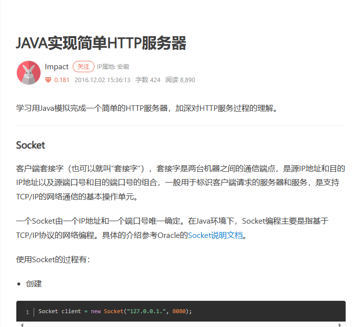

### 这是一个简单的Servlet容器，J2EE课程作业之一

**要求:**

参考该网页教程 [JAVA实现简单HTTP服务器](https://blog.csdn.net/weixin_34195546/article/details/88734718),实现一个servlet 容器，要求提交servlet 容器源代码和运行截图

#### 有一点很奇怪!

>本来链接是 https://blog.csdn.net/weixin_34195546/article/details/88734718

我浏览器中打开是简书 

复制到编辑器里面打开是 csdn 网页了

